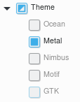
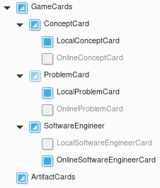

# ufmg.reuso.software
Reuso e aprimoramento do SimulES para criação de uma SPL.

Grupo:
- Gabriel Bastos
- Fernanda Guimarães
- Daniel Cruz
- Manoel Júnior
- Lucas Furtini

## Plugins 
Para a compilação e execução do código, além da configuração da linha de produtos, são necessários dois plugins para o eclipse:
* [Maven](https://maven.apache.org/) (pré-instalado)
* [Feature IDE](https://marketplace.eclipse.org/content/featureide)
* [AWS Toolkit](https://marketplace.eclipse.org/content/aws-toolkit-eclipse)

Para utilização do AWS Toolkit, que permite uma visualização dentro do próprio eclipse do repositório de cartas online, é necessária a autenticação no serviço AWS.
As credenciais disponibilizadas possuem as duas chaves necessárias:

* aws_access_key_id
* aws_secret_access_key

É possível também, para configuração do acesso, adicionar os arquivos *credentials* e *config* diretamente no diretório:

* Windows: "%UserProfile%\.aws"
* Linux, macOS, ou Unix: ~/.aws

## Software Product Line
O diagrama da linha de produtos pode ser encontrado no arquivo [model.xml](model.xml).
### Configuração
A configuração das features pode ser realizadas através do arquivo [default.xml](configs/default.xml).
#### Theme

#### GameCards

